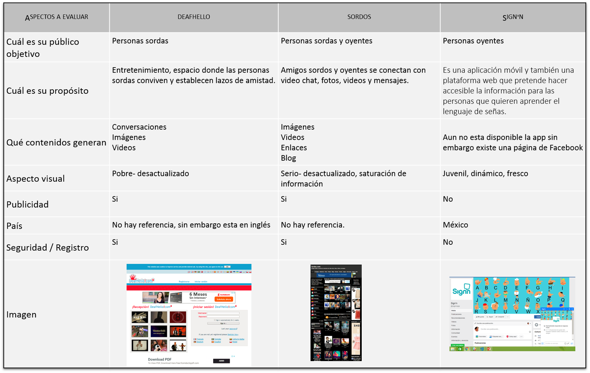
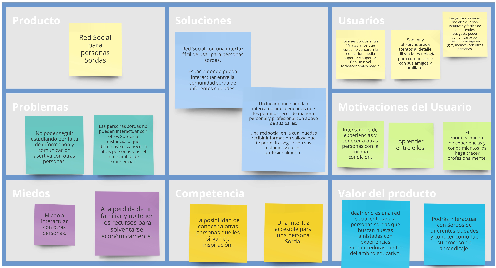

# Deafriend (Social Network React)

##Red Social - Proceso UX
Las redes sociales son sitios donde un grupo de personas con intereses comunes se comunican e interactuan en torno a un tema.
Una emprendedora nos ha encargado crear una red social.  Nos da ciertos temas en los que le gustaría invertir:

-   Alimentación
-   Feminismo
-   Educación
-   Salud
-   Energías Renovables

## Descubrimiento de la investigación
De acuerdo a lo anterior, nos decidimos centrarnos en el tema de educación específicamente en las personas con una discapacidad de tipo auditiva, para tener más información al respecto. Se realizaron dos tipos de investigaciones una documental y otra de campo.
En la primera de acuerdo a la documentación podemos definir los siguiente:

**Insights de la investigación**

*   Primer obstáculo es la comunicación.
    
*   Sordos tienen su propio idioma, su primer lengua es la de signos y la segunda el español.
    
*   Cuando no entienden algo pregunta a varias personas, ya que todos los días aprenden palabras nuevas.
    
*   Mejoran su lenguaje a través de sus propios recursos.
    
*   La sordera da lugar a una forma diferente de percibir y vivir el mundo que ha tenido como consecuencia el desarrollo de las lenguas de signos y la formación de comunidades de personas sordas con una historia y una cultura propias.
    
*   El español hablado como escrito y la lengua de señas tienen una gramática completamente distinta, lo que obliga a los sordos a razonar en dos formas diferentes.
    
*   Las redes sociales han modificado su vida debido a que sienten que escribir es útil.

En un segundo acercamiento al tema se decidió realizar un focus group con 5 estudiantes Sordos de Educación Media Superior, arrojando, en donde se hicieron diversas preguntas como: Qué red social utilizas con mayor frecuencia y porqué?; Qué problemas tienes al usarla?; Qué problemas tienes al interactuar con otras personas ya sean oyentes o sordos?; Cómo te comunicas con tus amigos?; Conoces algún sordo que haya estudiado la universidad?; Si existiera una red social solo para sordos que te gustaría que tuviera o para qué la usarías?

#Ana :girl:
#Ian:person_with_blond_hair:
#Hector:man_with_gua_pi_mao:
#Israel:boy:
#Jose Armando:man:

|Nombre / Datos generales  | Preguntas / Respuestas  |
|--|--|
| **Israel, 23 años** Estudiante de Educación Media Superior Iztapalapa Utiliza su smartphone| **Cómo te comunicas con tus amigos o familia?** Por medio de mensajes, whatsapp o Lenguaje de señas. **Cómo te comunicas con tus amigos oyentes?** Escribimos mensajes pero es difícil porque el español es complicado para nosotros a veces no entendemos lo que dicen y nos confundimos. **Cuál es la red social que más utilizas?** Whatsapp **Por qué utilizas esta red social?** Es fácil **Qué problemas tienes en la educación por ser una persona sorda?** Materiales difíciles muchas palabras en español que no conozco. **Conoces algún sordo que haya cursado la universidad?** No **Quieres continuar con tus estudios a nivel superior?** Si, quiero estudiar fotografía, aunque aún no se donde. **Te gustaría tener ayuda de otros sordos para seguir estudiando?** Me gustaría en un futuro aprender, quisiera que me ayudaran las personas, familia, maestros para aprender más para en un futuro ir a la universidad. |
| **Jóse Armando 24 años** Estudiante de Educación Media Superior Tlahuac Utiliza su smartphone | **Cómo te comunicas con tus amigos o familia?** Por whatsapp, facebook, messenger, con mi familia por medio de mensajes en el telefóno. **Cuál es la red social que más utilizas?** Whatsapp **Quieres continuar con tus estudios a nivel superior?** Yo quiero trabajar de mesero.  |
| **Ian 24 años** Estudiante de Educación Media Superior Ecatepec Utiliza su smartphone | **Cómo te comunicas con tus amigos o familia?** Whatsapp, facebook **Cuál es la red social que más utilizas?** Whatsapp **Qué problemas tienes al usarla?** Difícil español, es confuso lo que dicen. **Cómo resuelves este problema?** Imágenes, envío vídeo con señas o busco en el diccionario. **Conoces algún sordo que haya cursado la universidad?** No **Quieres continuar con tus estudios a nivel superior?** No se, depende de lo que diga mi mamá. |
| **Hector 26 años** Estudiante de Educación Media Superior Ajusco Utiliza su smartphone |**Para qué utilizas una red social?** Facebook, instagram, twitter. Las personas las utilizan para mandar mensajes o subir vídeos, comunicándote desde lugares lejanos. Los oyentes escriben mensajes y nosotros subimos vídeos a amigos o familia. **Cuál es la red social que más utilizas?** Facebook, Tumblr **Conoces algún sordo que haya cursado la universidad?** No **Si pudieras crear una red social solo para sordos que te gustaría que tuviera?** Que sea fácil y gratis. **Quieres continuar con tus estudios a nivel superior?** Si quiero estudiar química en la UAM **Te gustaría tener ayuda de otros sordos para seguir estudiando?** Sería interesante conocer a otros para saber cómo estudiaron la universidad, sí es difícil o fácil.  |
|**Ana 19 años** Estudiante de Educación Media Superior Iztapalapa Utiliza su smartphone  | **Cómo te comunicas con tus amigos oyentes?** Con mi familia ellos hablan así que yo leo los labios o si no me envían mensajes por whatsapp. Es difícil porque siempre ellos están hablando y pregunto que significa y a veces no saben cómo explicarme. **Cuál es la red social que más utilizas?** Whatsapp, Facebook Por qué utilizas esta red social? Es fácil y mi familia y amigos la tienen. **Conoces algún sordo que haya cursado la universidad?** No **Si pudieras crear una red social solo para sordos que te gustaría que tuviera?** Fácil, palabras fáciles, enviar imágenes(gif) y memes me gustan para compartir con otras personas. Conocer personas de otros países para aprender de ellos y después viajar. **Quieres continuar con tus estudios a nivel superior?** Si, pero no se donde estudiar. **Te gustaría tener ayuda de otros sordos para seguir estudiando?** Yo no conozco a otros sordos de universidad pero me gustaría platicar para saber más de ellos.|

**Insights del focus group**

*   La red social que más utilizan los sordos es el whatsapp.
    
*  La comunicación con las personas oyentes es por medio de la escritura.
    
*   Ninguno conoce a otra persona sorda que haya cursado la universidad.
    
*   Sin embargo la mayoría del grupo quiere continuar con sus estudios superiores, aunque desconocen en qué institución puedan ingresar.
    
*   Han tenido problemas con sus amigos oyentes porque no entienden los mensajes que se escriben generan desacuerdos entre ellos.
    
*   Les gustaría tener una red social para la comunidad sorda ya que permitiría el intercambio de experiencias y conocer a otras personas con la misma condición. Aprenden de otros.
## Bechmark

## User Centered Design Canvas 

## Análisis Argumentativo

Las redes sociales son sitios de Internet formados por comunidades de individuos con intereses o actividades en común y que permiten el contacto entre estos, de manera que se puedan comunicar e intercambiar información.

En México existen 2.4 millones de sordos, de los cuales, 124 mil 554 son jóvenes entre los 15 a 29 años, de estos el 28% no tienen ningún tipo de educación(INEGI 2014). A pesar de que muchos tienen un certificado de educación básica, hay un alto porcentaje que tienen rezago educativo en el área de matemáticas y lectoescritura.

El rezago educativo al que se enfrentan es el resultado por su paso en escuelas para oyentes en donde suelen ser excluidos o se les aprueban de grado sin necesidad demostrar sus conocimientos. La falta de educación para personas que no escuchan es causa de pocas oportunidades laborales. Es así que el 67% de esta población joven, es decir 83 mil no tienen ingreso económico propio.

La principal obstáculo al que “se enfrentan al momento de comunicarse con personas oyentes es la comprensión de la información ocasionada por un lenguaje pobre, que conduce a la marginación de la persona sorda.” (Amondarain y Correa, 2001). El español hablado como escrito y la lengua de señas tienen una gramática completamente distinta, lo que obliga a los sordos a razonar en dos formas diferentes.

Los sordos, se caracterizan fundamentalmente porque no pueden comunicarse por medio del habla con quienes los rodean,no de modo fluido y natural. Ellos necesitan comunicarse y socializar tanto como cualquier ser humano.En la actualidad la tecnología es una herramienta útil para la comunidad sorda. Los celulares han modificado su vida gracias a los mensajes de texto o video llamadas, en algunos casos ha mejorado el nivel de lectoescritura.

Se identificó que los jóvenes que terminan su educación media superior con esta condición si bien tienen la motivación de seguir adelante no cuentan con la orientación hacia que instituciones educativas dirigirse. De acuerdo a esta problemática es que surge la necesidad de crear una red social que permita la comunicación entre las distintas personas sordas que se encuentran en el país. Esta red permitirá el intercambio de experiencias educativas entre jóvenes sordos que ya han terminado su formación académica a nivel superior y aquellos que están próximos a terminar preparatoria.

Lo que permitirá que personas bajo la misma condición se den consejos para seguir estudiando, se identificaran entre ellos y favorecerá su autoestima y la imagen que tienen de sí mismos para su futuro. Será una oportunidad para que se den cuenta de que la sordera en sí no les impedirá alcanzar sus sueños si se lo proponen como hicieron otras personas con esta condición.

## Target

*   Jóvenes Sordos entre 19 a 35 años que cursan o cursaron la educación media superior y superior.
    
*   Con un nivel socioeconómico medio.
    
*   Son muy observadores y atentos al detalle.
    
*   Utilizan la tecnología para comunicarse con sus amigos y familiares.
    
*   Les gustan las redes sociales que son intuitivas y fáciles de comprender.
    
*   Les gusta poder comunicarse por medio de imágenes (gifs, memes) con otras personas.
   

## Argumentación del proyecto.

1.  **Negocio**. La *UNESCO* señala en su declaración mundial de 1990 que *“Educación para todos”*. Bajo este principio y aunado al nuevo modelo educativo incluyente. Las universidades han desarrollado proyectos de inclusión. Tal es el caso de la Universidad Santa Catarina, en Nuevo León, donde si un alumno sordo necesita un traductor a Lengua de Señas Mexicana, éste llega al salón cuando va a tomar clase; Universidad Teletón, con su cultura incluyente; UNAM fomentando una cultura de integración para personas con discapacidad; Universidad de Coahuila; UDG.

Sin embargo estas universidades no cuenta con suficiente publicidad para llegar al público adecuado y así responder a sus necesidades. Por lo cual tener una plataforma donde se concentren estudiantes cuyo perfil encaja para estudiar la universidad y tener ex alumnos de estas instituciones siendo los principales promotores. Permitirá ofrecer a estas instituciones un espacio para su publicidad dirigida específicamente a estudiantes que están por cursar su educación superior.

Además de ofrecer un espacio para que otras instituciones ofrezcan cursos o talleres a un público que ha estado descuidado o bien publicitar servicios como intérprete.
  

2.  **Usuario**. Si bien existen redes sociales dirigidas a personas sordas, se ha dejado de lado el tema de educación. Siendo así un target potencial para su atención.

## Historias de Usuario

Los usuarios son estudiantes Sordos de preparatoria que esta próximo a culminar sus estudios, tienen la intención de seguir estudiando el nivel superior sin embargo no conocen a ninguna persona Sorda que haya cursado la universidad.

Ellos quieren estudiar una carrera pero no conoce ninguna escuela que los acepten por su condición. Han tratado de buscar información en internet sin embargo los textos con los que se enfrentan son muy difíciles por lo que prefieren preguntar entre sus amigos, aunque ninguno de ellos tiene conocimientos al respecto.

Les han platicado que existe una red social para personas Sordas donde platican sus experiencias educativas. Esto le sirve para que otros conozcan las distintas posibilidades que tienen para seguir estudiando. Ellos también puede motivar a otros a culminar la preparatoria.

Ellos esperan que esta red social les permita comunicarse de manera fácil con otros y así conocer a otras personas que como ellos, día con día se enfrentan a un mundo de oyentes.

Los usuarios necesitan que esta red social sea un espacio seguro y donde pueda platicar en confianza, por lo que esperan que al momento de registrarse se utilice un lenguaje claro y sencillo que les permita seguir cada uno de los pasos.

Una vez registrados necesitan que la aplicación tenga información visual que los guie al momento de publicar algún comentario y en donde ellos pueda ver los comentarios de los otros usuarios. Ya que esta red social permite la interacción con personas que no conoce, para los usuarios es importante tener una imagen de su rostro para poder identificarlos. Los Sordos son personas muy visuales así que fácilmente identifica el significado de los iconos.

Les gustaría que  al momento de escribir un mensaje ellos tuviera la oportunidad de editarlo por si al momento de escribir la redacción no sea la correcta. También quisieran eliminarlos si por algúna razón se equivocaran.

Es importante que algún mensaje importante se destaque por el número de "me gusta" que tiene. Y así poder identificar fácilmente las conversaciones más destacadas.

Esperan tener un espacio solo para ellos donde puedan escribir una pequeña semblanza de quienes son y compartirlo con las personas que deseen.

# Deafriend 

Es una red social que busca ser un espacio donde personas jóvenes Sordas se comunican entre si y comparten sus diferentes experiencias en el ámbito educativo. Si quieres conocer más de este proyecto ingresa a (https://brenduchiz.github.io/react-redsocial/)

1. Ingresa tus datos para registrarte o bien utiliza alguna de tus redes sociales.
2. Se parte de la comunidad Sorda online.

Instrucciones para desarrolladorxs:
1. Realiza un fork de este repositorio.
2.️ Clona tu fork a tu computadora.
3. Instala las dependencias del proyecto con el comando npm install. 

Si deseas aportar al proyecto escríbenos un issue o haz un pull request. 